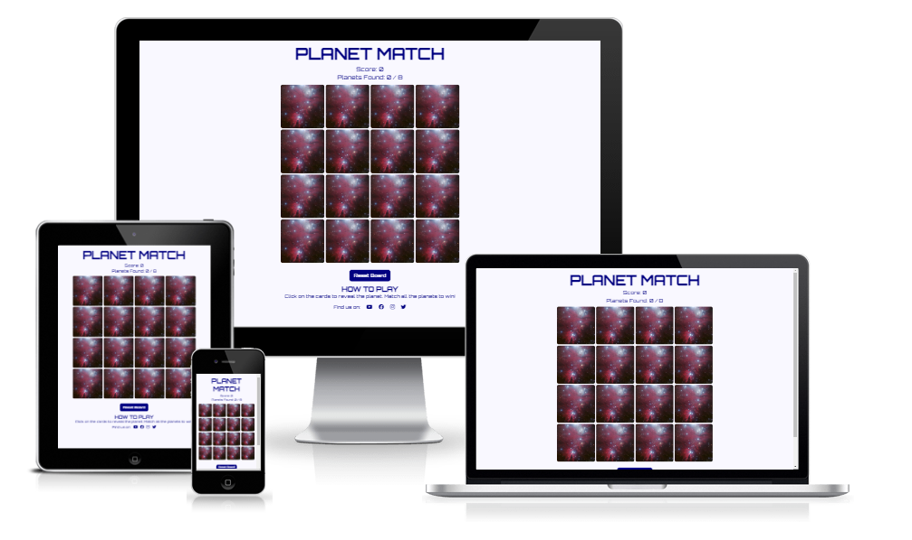
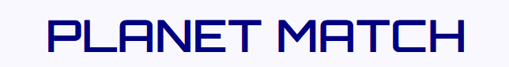
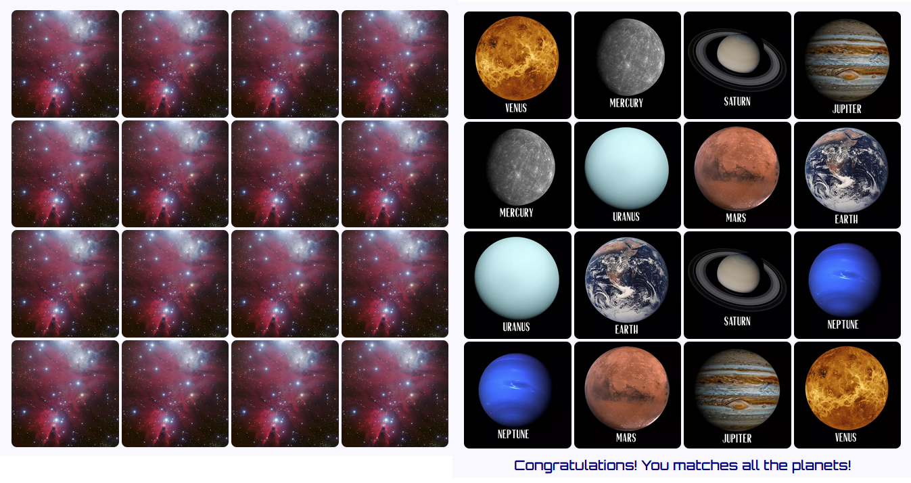
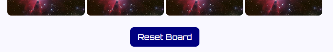
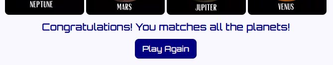
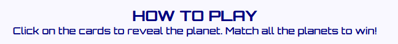
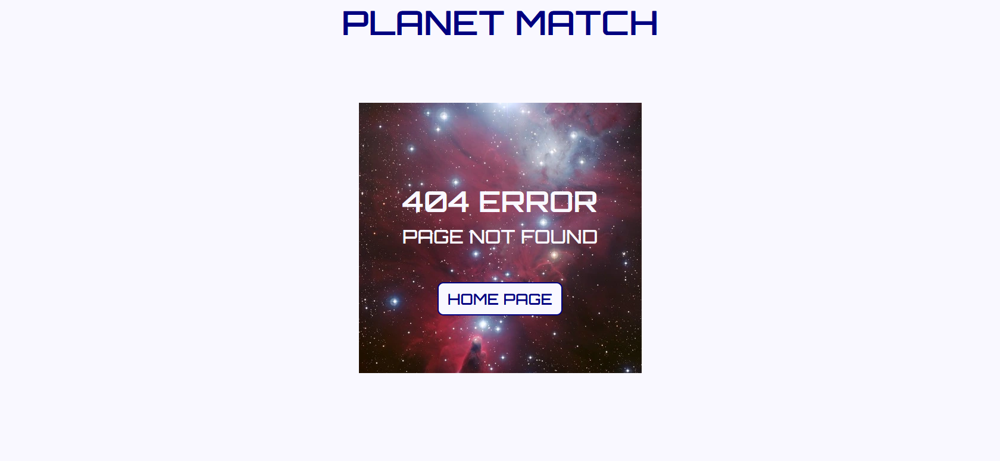
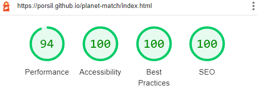

# <h1 align="center">**PLANET MATCH**</h1>

[View the live project here](https://porsil.github.io/planet-match/index.html)

This is the website for Planet Match. A website for playing a matching planet card game. The website is responsive allowing the game to be played on a range of devices.

-   ### **Visitor Goals**

  1. Clearly understand the purpose of the site.
  2. Easily find the rules of the game.
  3. Easily play the game on any screen size.
  4. To be able to restart the game during play if desired.
  5. To be able to play the game again once completed.

-   ### **Wireframes**

    -   Wireframe - [View](assets/read-me-docs/planet-match.pdf)

-   ### **Design**

    -   The two main colours used are navy and a very pale blue.
    -   The backs of the cards feature a nebula picture which is dark red.
    -   The planet cards feature a picture of the planet above the planet name in white text on a black background.
    -   The font used throughout the website is Orbitron. This font is easy to read and fits the space theme well.
    -   In case the fonts do not import into the website correctly, Sans Serif was used as the backup font.

-   ## **Existing Features**

-   **Game Name**

    -   The game name is displayed at the top of the page and the name is simple to allow clear understanding of the game.
    -   This addresses visitor goal 1.

-   **Game Area**

    -   The game area features the 16 cards in a 4 x 4 grid. The grid changes size depending on the device width to allow the game to be played on all screen sizes.
    -   The game loads with the planet pictures shuffled and hidden from view as the card back is shown.
    -   When the cards are clicked on the planet is revealed.
    -   After two planets are revealed the game turns them back to the card back if the planets do not match or keeps the planets revealed if they do match.
    -   Once all the planets are matches, the game has been won and a congratulations message appears under the game area.
    -   This addresses visitor goal 3.

-   **Reset Board & Play Again Button**

    -   Underneath the game board is a button that allows the user to reset the game and start again.
    -   Initially and during game play this button displays 'Reset Board'.
    -   After the game is completed the button display is changed to 'Play Again'.
    -   This addresses visitor goals 4 & 5.

-   **Game Rules**

    -   The game rules are permanently displayed at the bottom of the site to be easily found at all times during game play.
    -   This addresses visitor goal 2.

-   **404 Page**

    -   A 404 error page was created to notify the user if they attempted to navigate to a page or file that does not exist.
    -   This page offers a button to return to the home page and keeps the styling from the game play page.

-   **Further Features to Implement**

    -   To improve the site, different difficulty levels could be implemented. For example, changing the number of cards or having facts as one card (e.g. "The smallest planet" card matches the Mercury card).

-   ## **Responsiveness**

The website is responsive on all device sizes and to maximise the websites visual appeal and useability of the site by changing size depending on the screen size. This addresses visitor goal 3.

-   ## **Technologies Used**

-   **Languages Used**

    -   HTML5
    -   CSS3
    -   Javascript5

-   **Frameworks, Libraries & Programs Used**

    -   [Google Fonts](https://fonts.google.com/) were used to import the 'Orbitron' font into the style.css file. This font is used throughout all pages of the website.
    -   [Gitpod](https://gitpod.io/) was used for version control by utilizing the Gitpod terminal to commit to Git and push to [Github](https://github.com/) which then stored the project code.
    -   [Balsamiq](https://balsamiq.com/) was used to create the wireframe for the website.
    -   Microsoft Paint was used to create the planet images.
    -   [Ezgif](https://ezgif.com) was used to re-size the planet images and convert all images to webp format.

-   ## **Testing**

The site was frequently tested during development on Firefox, Google Chrome and Microsoft Edge browsers. The development tools were used frequently to log text to the console to test the javascript fuctions during game development and to view the site layout on different devices as well as using the 'responsive' setting to see at what sizes the layout became distorted.

*****************************************************************************
Once deployed the website was tested on Firefox, Google Chrome and Microsoft Edge browsers on a desktop and on a Kindle Fire and iPhone12, in both portrait and landscape.

Testing of the website was also performed by family on a Samsung Galaxy Tab A and a Samsung Galaxy J5 to aid in the discovery of bugs and user experience issues.
*****************************************************************************

The game was also tested by my planet mad 5 year old son, Alex, whom the game was created for.

-   **Bugs**

    -   The flipCard and checkCards function would intially not work. Moving some of the variables to outside of the fucntion fixed this.
    -   If more than 2 cards are clicked in the 0.5 seconds before the checkCards function is invokes, then the game breaks as one card is left face up. This bug has not been fixed.

-   **Validator Testing**

    - HTML
        -   When passed through the [official W3C HTML validator](https://validator.w3.org/) no errors were found.
    
    - CSS
        -   The [official W3C CSS Validator](https://jigsaw.w3.org/css-validator/#validate_by_input) gave an error as the 2 parameters given for padding had a comma sepataing them. The comma was removed to resolve the error.
    
    - JS
        -   The code was passed through [JSHint](https://jshint.com/), which was configured to ES6, some missing semi-colons were flagged. The semi-colons were added to resolve the warnings.

-   **Accessibility Testing**
      
    -   WebAIM Contract Checker
        -   The navy and very pale blue colours were checked through [WebAIM Contrast Checker](https://webaim.org/resources/contrastchecker/), both light on dark and dark on light combinations passed all WCAG tests.

    -   Lighthouse
        -   Lighthouse reports were generated through the Google Chrome developer tools at several points during the websites development.
        -   The first report gave a accessability score of 82, due to no alt labels being added to the images. Javascript code was added to include alt labels on all images, which improved the score to 100.
        -   The final report after deployment gave the following scores:

        

-   ## **Deployment**

-   **GitHub Pages**

The project was deployed to GitHub pages using the following steps:

   1.   Log in to GitHub and locate the GitHub repository.
   2.   Select the "Settings" button at the top of the repository.
   3.   Select the "Pages" tab on the left-hand menu to open the "GitHub Pages" section.
   4.   In the "Source" section, click the dropdown labelled "None" and select "Main".
   5.   The page will automatically refresh, and the published site link is given at the top of the "GitHub Pages" section.

-   ## **Credits**

-   **Code**

    -   The code to import the fonts was taken from [Google Fonts](https://fonts.google.com/).
    -   The Javascript code was based on the principles given in [Ania Kubów's Memory Game video](https://www.youtube.com/watch?v=tjyDOHzKN0w).
    -   The onclick code for the refresh button was taken from this [stackoverflow post](https://stackoverflow.com/questions/29884654/button-that-refreshes-the-page-on-click).
    -   The code for shuffling the cards using the Fisher Yates method was taken from this [w3schools page](https://www.w3schools.com/js/js_array_sort.asp).

-   **Media**

    -   The pictures used were taken from [Pixabay](https://pixabay.com/):
        - [Mercury](https://pixabay.com/photos/mercury-planet-surface-solar-system-11591/)
        - [venus](https://pixabay.com/photos/venus-earth-size-comparison-planets-11588/)
        - [Earth](https://pixabay.com/photos/venus-earth-size-comparison-planets-11588/)
        - [Mars](https://pixabay.com/photos/mars-red-planet-planet-space-11012/)
        - [Jupiter](https://pixabay.com/photos/jupiter-planet-solar-system-5263284/)
        - [Saturn](https://pixabay.com/photos/saturn-planet-solar-system-6063393/)
        - [Uranus](https://pixabay.com/photos/uranus-planet-gas-planet-space-11625/)
        - [Neptune](https://pixabay.com/photos/neptune-planet-solar-system-67537/)
        - [Nebula for card back](https://pixabay.com/photos/ngc-2264-dark-cloud-cone-nebula-11176/)
        - [Rocket for favicon](https://pixabay.com/vectors/rocket-icon-symbol-gui-internet-1976107/)
